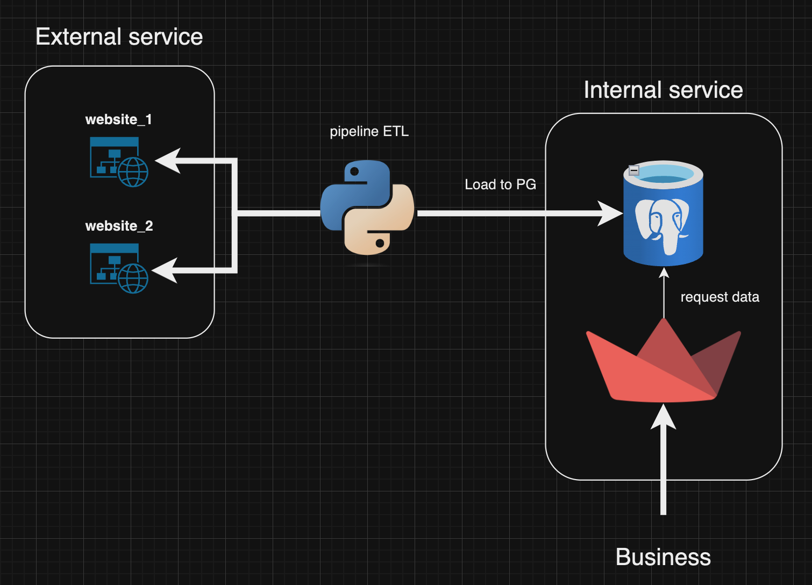
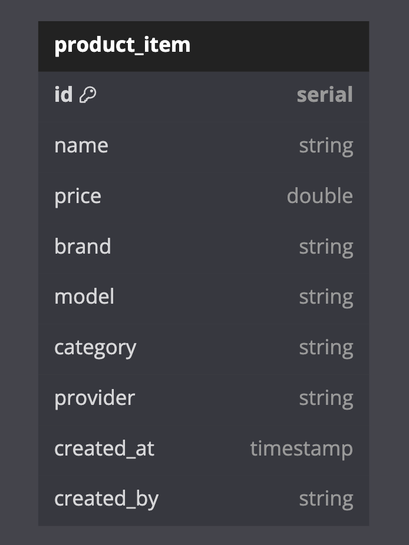
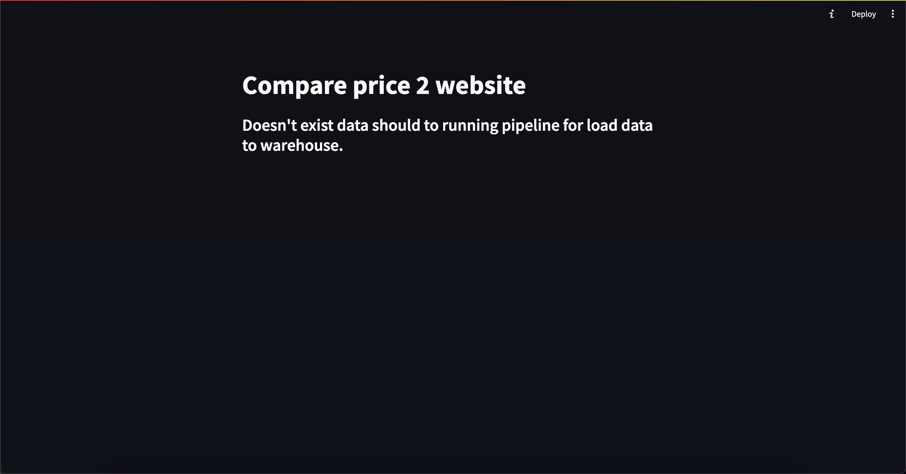
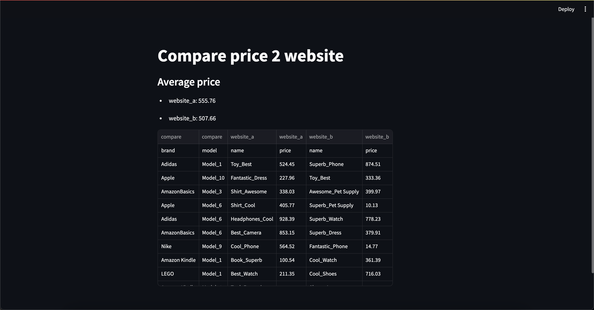

## Workflow


ฝั่ง api จะเป็นเหมือนกับ external service ที่เราอยากจะ ingest data มาเก็บไว้ที่ระบบของเรา โดยจะเขียน script Python ขึ้นมาเพื่อที่จะ ingest data จาก api เป็น pipeline หล้งจากดึงมาแล้วจะนำไปเก็บไว้ที่ Database โดยจะใช้เป็น Postgres ฝั่ง internal แล้วจากนั้นจะดึงไปขึ้นระบบ ให้ user สามารถ compare สินค้าชนิดเดียวกัน (brand, model)
Tools
- Database: Postgres
- Programming: Python
- Container: Docker
- Package: Fastapi, Pandas, Streeamlit, Sqlalchemy

## DDL Table



---

## Step to build
### Go to build image api for start api for ingest data
```
> cd api
> docker build -t api .
```
### Back to root project and build analytics
```
> cd ../analytics
> docker build -t analytics .
```

### After build 2 images success time to run service

```
> cd ..

#### For starting service api
> docker-compose -f docker-compose-data.yml up -d

#### For starting service database, analytics
> docker-compose -f docker-compose-internal.yml up -d
```

you can see result on
http://0.0.0.0:8501

because of pipeline didn't start.


---

## Run pipeline for ingest data to database
```
> pip install -r requirements.txt
> python pipeline.py
```

after running pipeline data will load to warehouse

